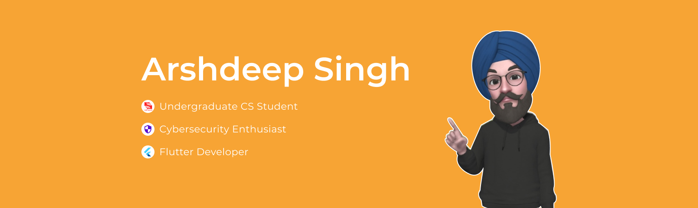

<h2> Hello, geeks!  </h2>

<h2> I'm Arshdeep Singh! </h2>

-  Undergraduate <b>CS Student</b> at Symbiosis Institute of Technology, Pune. 

-  Avid UI Designer & <b>Flutter Developer</b>.

-  Passionate about <b>Cybersecurity</b> & Threat Intelligence.

 
<h2> 💻 Languages & Tools </h2>

  &nbsp;  &nbsp;  &nbsp; &nbsp;  &nbsp;  &nbsp; &nbsp;  &nbsp; &nbsp;    

 
<h2> 📫 Find me elsewhere </h2>

 &nbsp;
 &nbsp;
 &nbsp;

